XSVA
====

Expected behavior: vertical serifs collapse/expand horizontally while everything else “stays the same”.

Uppercase
---------

### Straight to serif

##### XSVA min

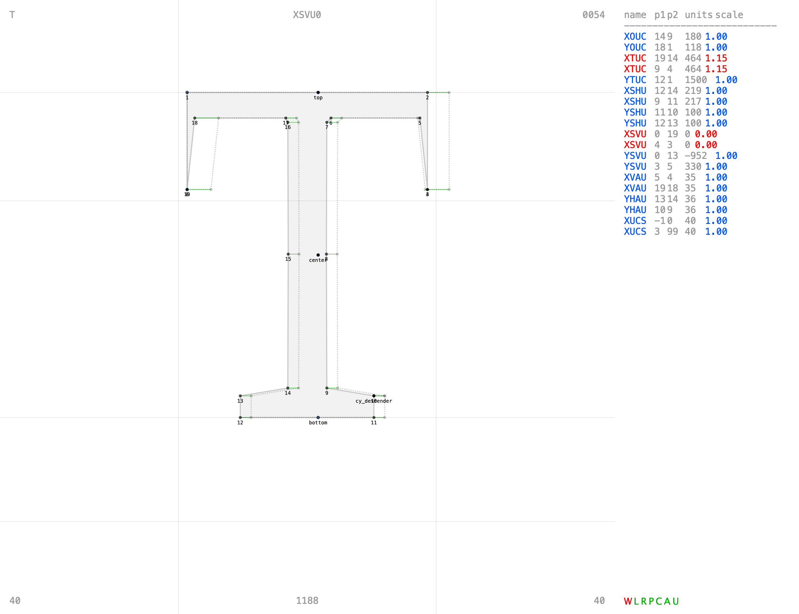

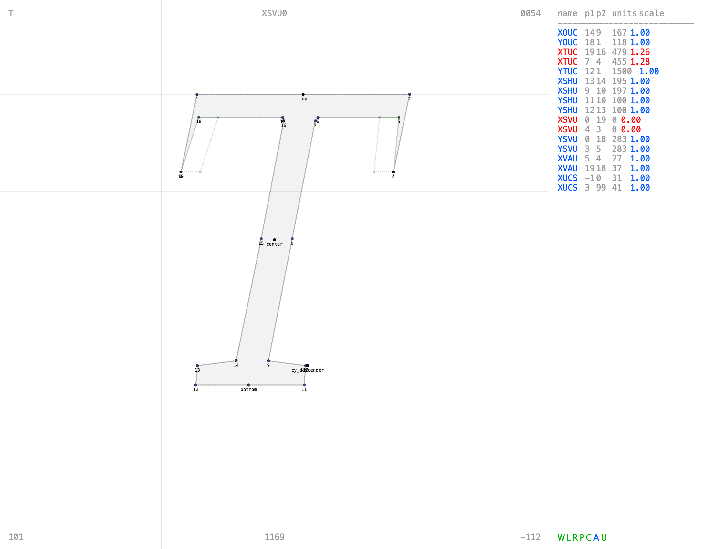

##### XSVA max

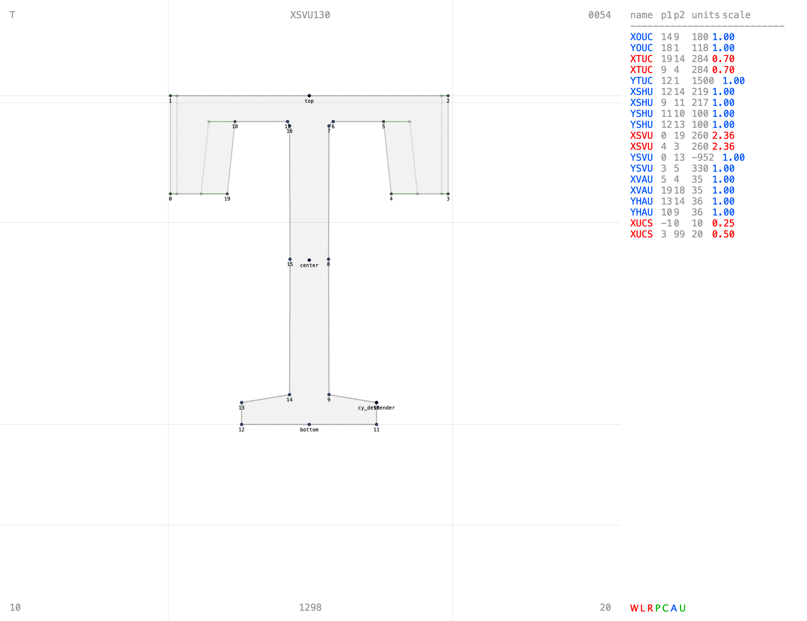

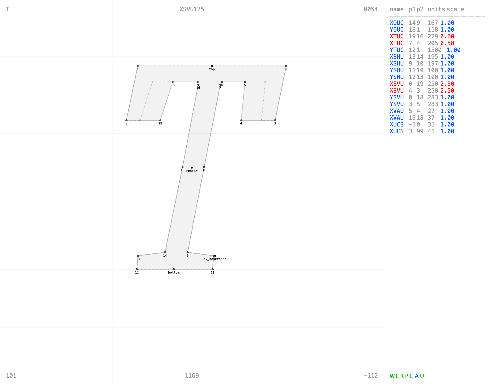

### Round to serif

##### XSVA min

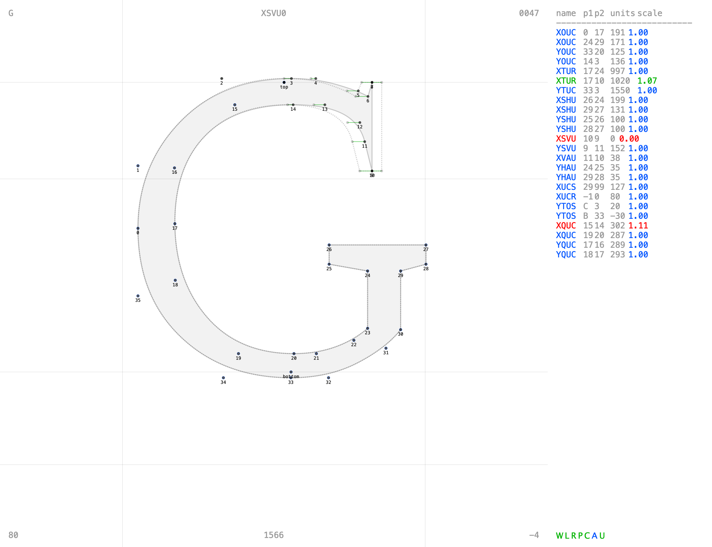

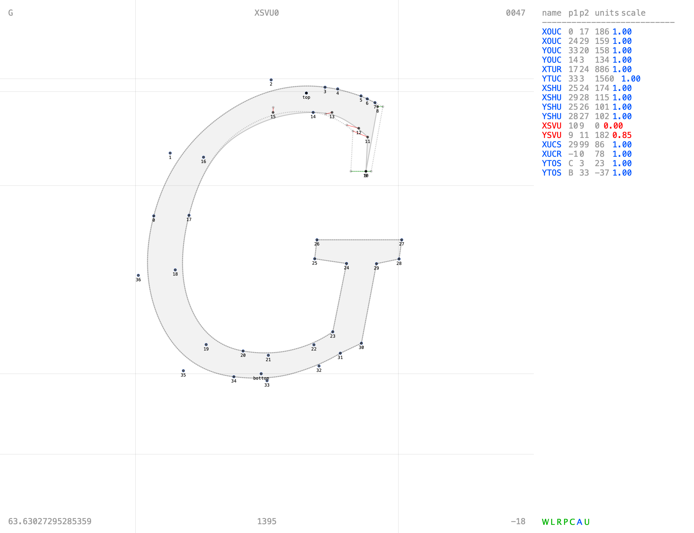

##### XSVA max

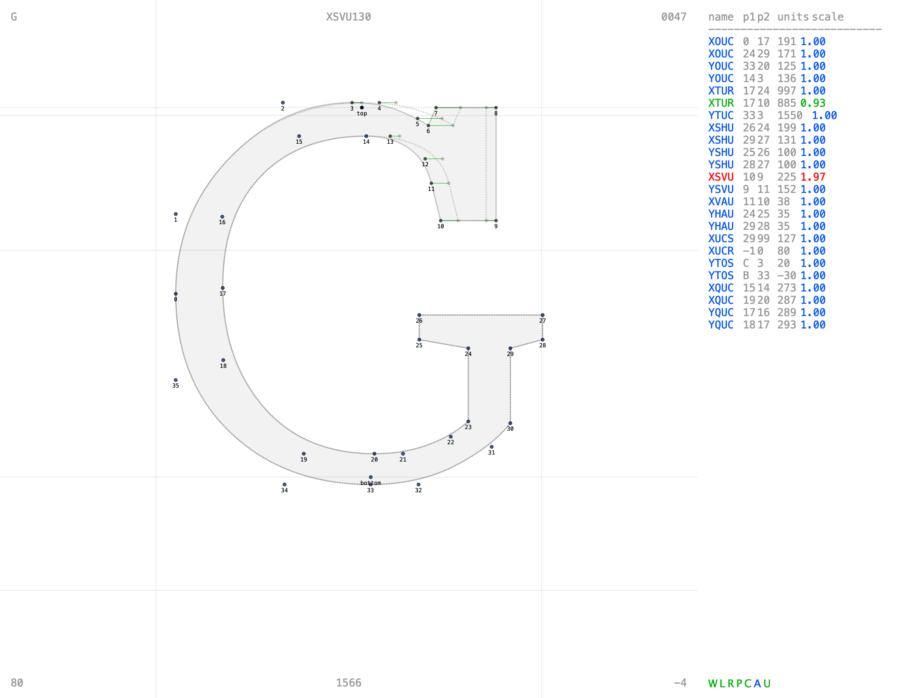

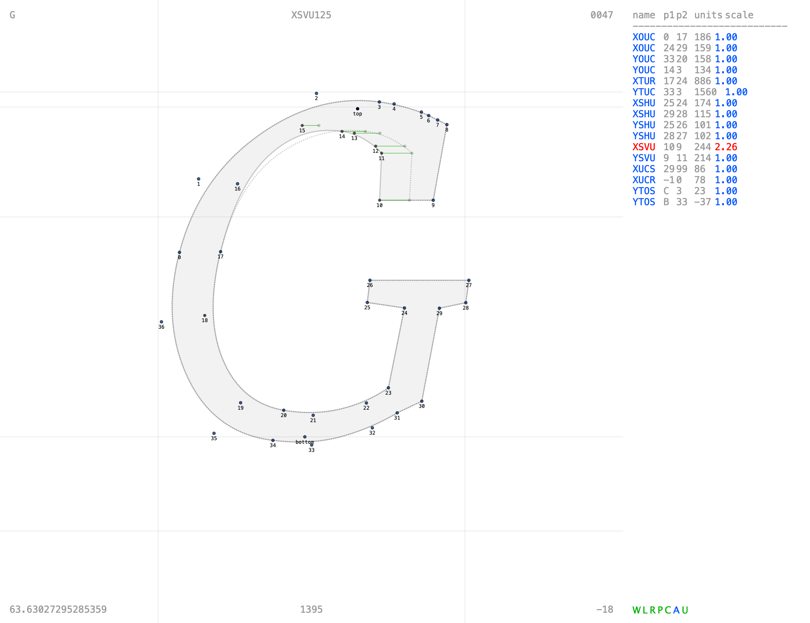

Lowercase
---------

### Straight to serif

AmstelvarA2 Roman:

- only XSVA changes
- xy directional deltas allowed on the diagonal direction for stroke continuity and in italics

##### XSVA min

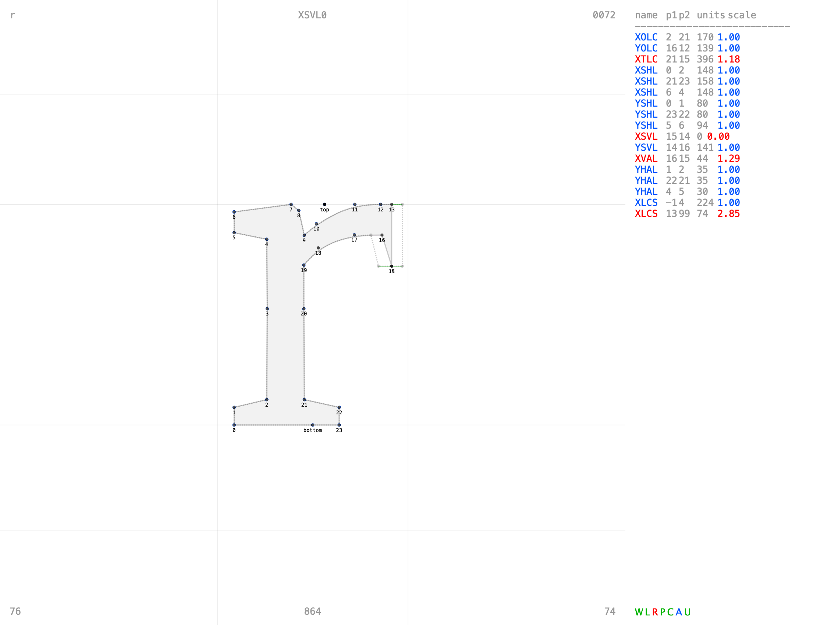

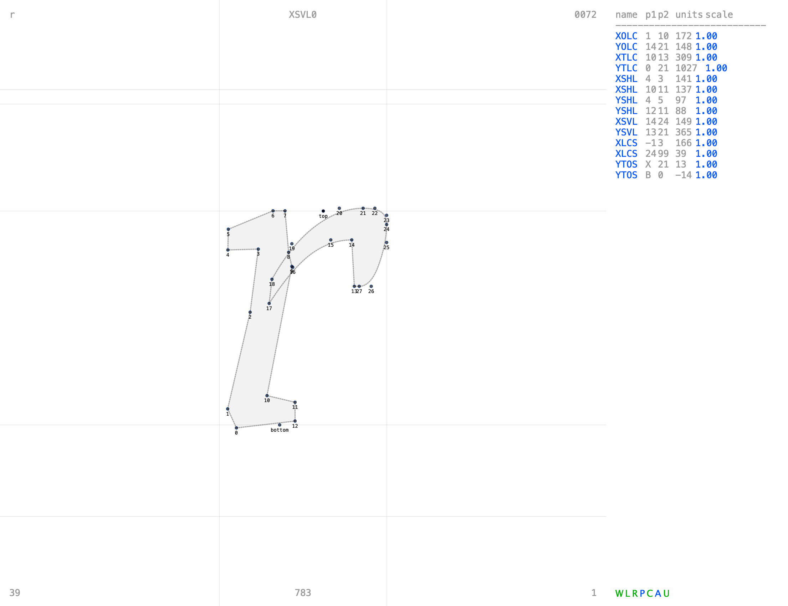

##### XSVA max

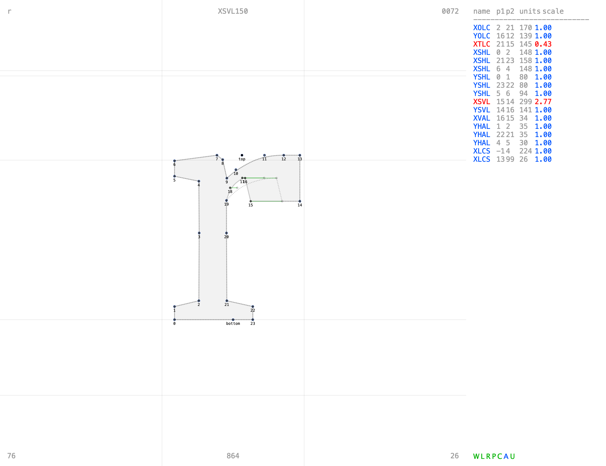

### Round to serif

AmstelvarA2 Roman:

- angle of slanted strokes does not change
- xy-direction deltas allowed in slanted strokes
- slanted measurements are aligned to stroke
- XTRA may change slightly to accommodate angles

##### XSVA min

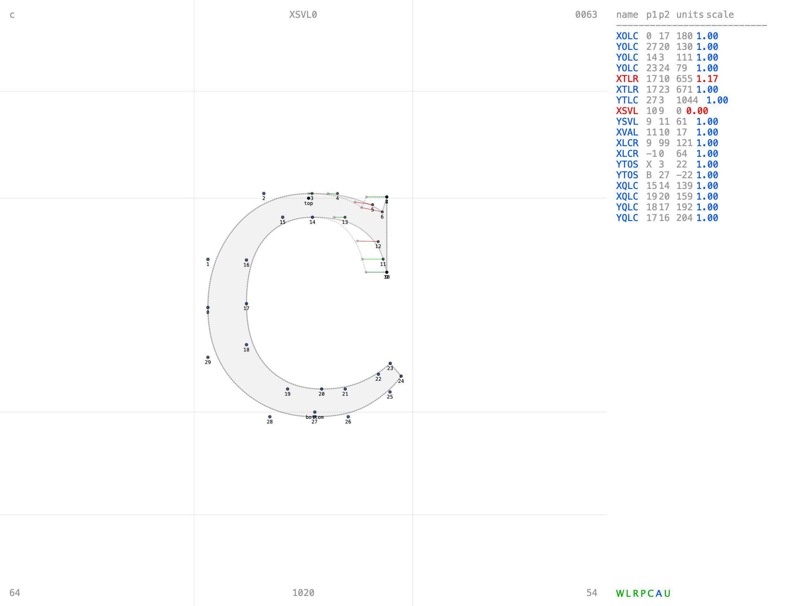

##### XSVA max

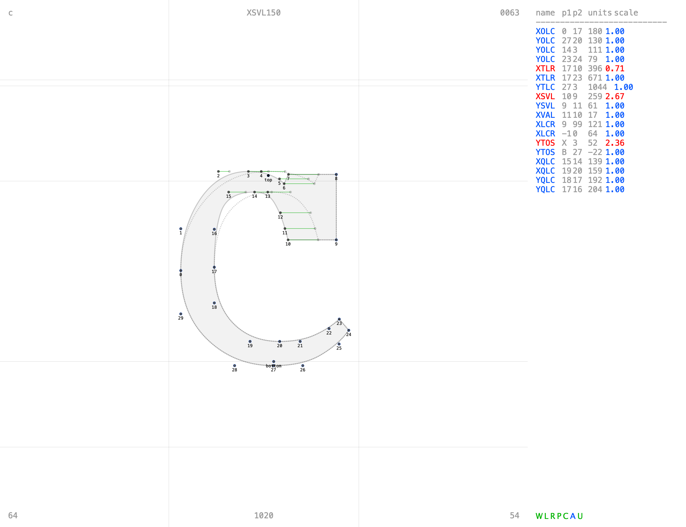

Etcetera
--------

...

